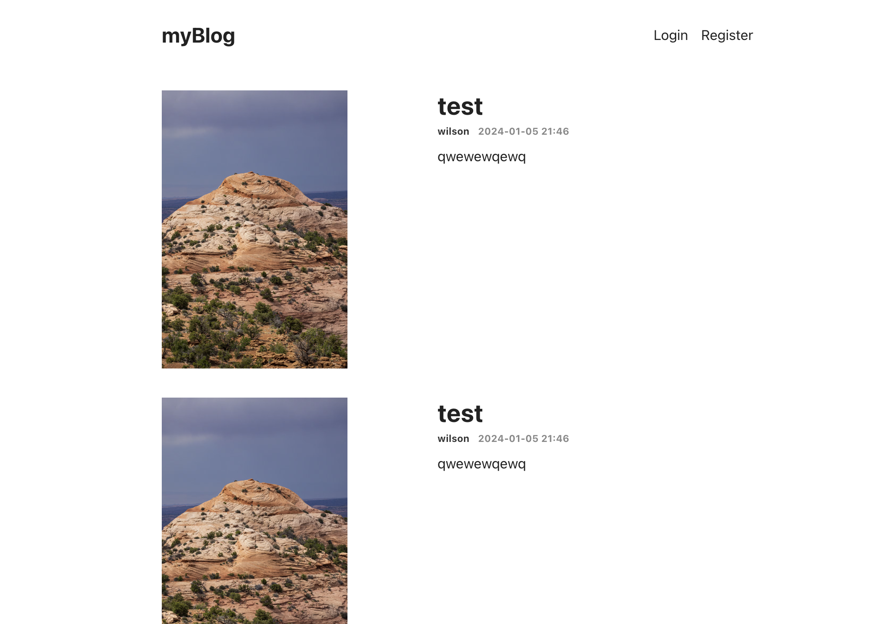
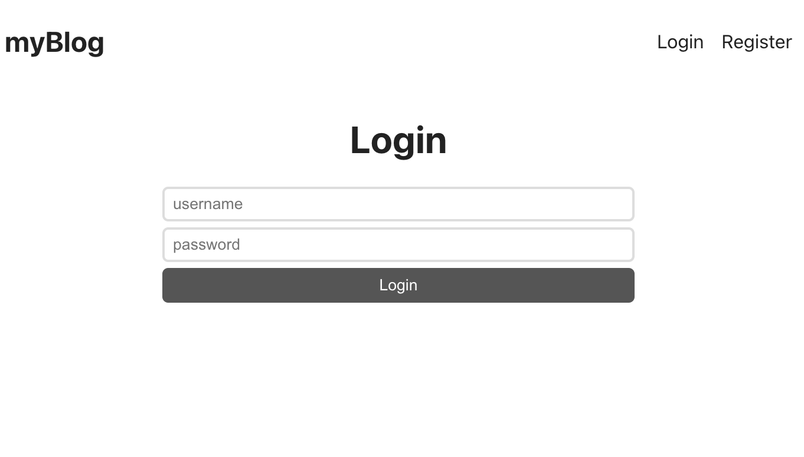
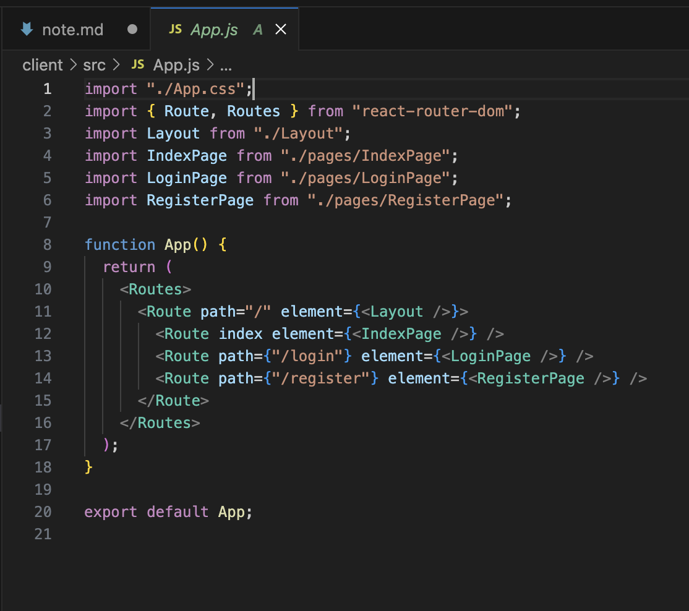
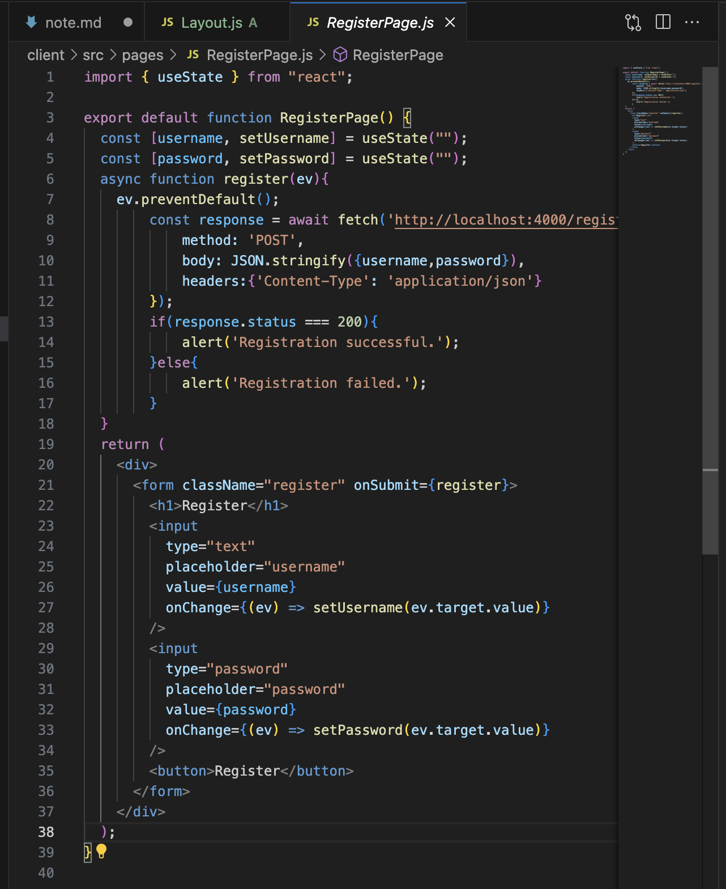

# day1 刻板面(router)、登陸系統（express、cors、mongodb、jwt、bcrypt)
## 刻板面(首頁版面, login register)

## router整理版面 切成四個頁面 登陸系統做在login and register page, blog內容做在indexpage, layoutpage的outlet react dom 

## 後端登陸系統測試mongodb
### 當使用者在register page輸入資訊時usestate會儲存資料，按鈕被onsubmit功能改寫成register()

## 後端ＡＰＩ
